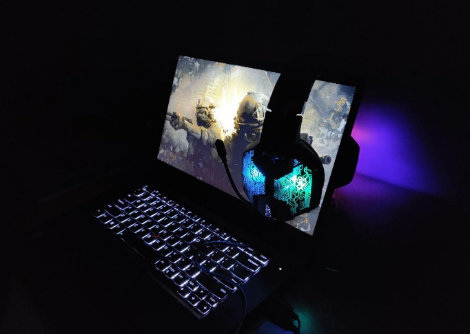
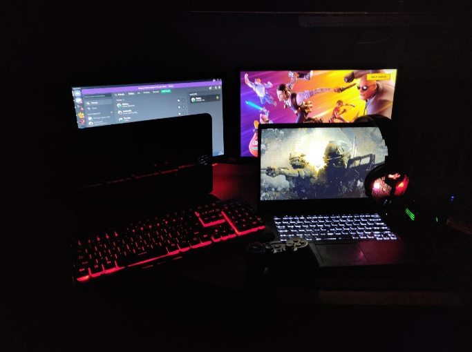

+++
author = "c4ndy during first wave"
title = "Destination Outside"
date = "2020-04-29"
description = "Sample article showcasing basic Markdown syntax and formatting for HTML elements."
tags = [
    "markdown",
    "css",
    "html",
]
categories = [
    "themes",
    "syntax",
]
series = ["Themes Guide"]
aliases = ["migrate-from-jekyl"]

+++

# DESTINATION OUTSIDE

### What is travel like, when you can't travel

****

"My body finally registers that I ranked up to "the global elite rank". As I remove my headphones after a long Counter-Strike gaming streak; another shock comes my way. I feel myself getting sucked in by a wormhole like force accompanied by a sharp, ear-splitting sound which gradually decreases in amplitude rendering me nauseated. I feel thrown into another world. 30 seconds later the familiarity of my surroundings register, growing stronger each moment.

"Wait, I've been in this world before. I think"

It's my world, right? I get out of my chair and take a few steps which quite imitate a toddler's first steps: only there was no one else cheer. While my brain attempts to acquaint itself with my surroundings, I hear grumbling from my stomach: I'm hungry. I decide to go looking for food and hopefully greet the inhabitants. I walk to the room next to mine to see a woman busy with her office work while simultaneously on a zoom call. I remember calling her mom. I go to the living room to find it being temporarily inhabited by a man which according to my subconscious is my dad. He is busy watching videos on WhatsApp. Next, I try my brother's room only to find him watching Naruto.

"Yes, I've been here", I conclude. I was here a few days ago(how many? You can't tell anymore) and it was the same.I sluggishly walk towards the kitchen determined to get myself out of this drugged state with a strong cold-pressed Americano. As the bitter-sweet aroma from the coffee beans I'm grinding reach my nose I picture myself at "Blue Tokai"- my favorite coffee shop, sitting across a handsome hunk-imagining his sharp cut jawline which he's decidedly hiding under his scrawny beard(I suspect it's on purpose) when the waiter gets our Cafe Mochas and strawberry french toasts. The thought of food jerks me back to this reality out of my melancholic remembrance of sweet Coffee dates. They are now a thing of the past when The Inside, The Outside, The Internet were one world. The pre-virus days.

I reach for my cold-press when I glance upon a copy of "The Times of India'' dated 27th September 2020. It's 9 months into the pandemic. Coronavirus2019 has been the greatest disruption to the movement of people since WW2. On the night of 24th March at 9 pm, the prime minister announced a nationwide lock-down restricting the movement of 1.2 billion people and giving everyone just 3 hours to prepare. The rich of-course had already hoarded up and had enforced a self-quarantine. The middle-class went into panic buying mode, the markets flocked with the crowd grappling for rations(A Wuhanese might call it as packed as the market in Wuhan). But the worst-hit of all was the poor who neither had the money or the means to hoard nor the privilege to self-quarantine: the low-paid migrant workers who lost their jobs and refugees or the displaced people. Their lives were precarious even before the pandemic spread. Migrant workers suffered as they struggled to return home with little or no money, in the face of travel restrictions and suspension of transport links. Hundreds of thousands of them crowded the roads on foot, creating the very conditions that the lockdown was meant to prevent.But that was just the beginning. The costs of secrecy were yet to be realized.

The travel story of COVID2019 from patient 0 till today is one with a system delay. What is a system delay one might ask? "**Delays are units that cause a time-shift in the input signal, but that don't affect the signal characteristics**" Let me cut off the technical jargon and explain through an analogy. When you take a bath in winter you open the geyser, wait 15 minutes for the water to heat up, and get into the shower. You open the tap and cold water comes out, so you gradually put the tap to the extreme warm setting, and suddenly it so happens that the extreme cold water switches to extremely hot water. You get a burn. Why did this happen? Because there was already some cold water in the pipeline and by the time it got filtered out you have moved to the other extreme. This is because water takes time to transmit through the pipeline. A similar thing is happening with this virus.

When the virus first broke out in Wuhan-China, the news of the virus was suppressed. When it could no longer be contained, the situation was gravely underplayed by various governments until the rising death toll could no longer be ignored. Leaders finally decided to put the planet on lockdown. Even though some healthcare systems were still up and running at that time, the system delay was already introduced. The spike had occurred and the spread couldn't be stopped. This begs the question: why the secrecy initially? Well it's just one of many legacies of obfuscation and repression: Chernobyl, Fukushima, and SARS.

My train of thought is interrupted by my mom walking in.

**"When did you get back?" she asks.**

"A few moments back. How long was I gone for?"

**"Just 2 days. You were gone when I came back yesterday”**

"Really? Is dad back yet?"

**"Not since last week."**

"Any new vaccines released?"

**Yes, 2 of em. I'll pick em up later after the quarantine suit dries up. Which reminds me we need to update those the new strain can permeate N-80 fabric**

“Didn't we just update our suits 2 weeks back? It’s mutating fast these days.”

**“Yeah, they’re saying they almost had it this time but then it mutated.”**

“That’s what they claim every time. I think they just want to look good. I tell you, it’s a war in disguise”

**“Anyway, moving on from those conspiracy theories of yours. Are the dissociations getting any better?**

“Oh yeah definitely. My memory came back about a minute and a half in this time”

Her phone vibrates. She checks it to see her colleague and best friend Umit is calling. 

**“Gotta take this. We’re having a bingo marathon. I shall be back in a few days hopefully. Do eat well”**

With that she takes her leave.

I hear a creak in from my brother’s room when it opens and he strolls out in a zombie state of mind. He appears to be still disassociating. Well it was bound to, he’s been gone for over a month now. I wait for him to come back.
“Hey, bro. Hungry? I’m making french toasts, shall I make some for you too?”

**“Hey sis. yes please. How long was I gone for?”**

“A month”

“**Oh, I thought so. It has been fun though. My entire highschool is camping together.”**

“Oh damn, that’s great!”

**“So who’s home?”**

“Oh just us. You missed mom just by a minute”

**“Really? Our timings just never synch in here. I last saw her 4 months ago. Eh, I’ll just send her an e-vite to my zoom room”**

“Alright. Anyway it was your b'day last week. I came to your room but you weren't here**”**

**“Yeah, I was celebrating it with my entire high school in zoom room 88. I sent you an e-vite too! You know even Jennifer came- and she’s a senior!”**

“Oh, I must have missed it. Glad to know that bro. Looks like things are looking up”

**“Yeah they are! Anyway I’ll go take a shower. Put extra Nutella on the side for me”****

With that he goes back to his room.

Aside from the imminent threat of death, the threat to all our collective consciousness was the fear of missing out or FOMO. The situation stipulated that a few months to a year would pass by before the normalcy returns. For our internet generation the birthdays, anniversaries, parties selfies, likes, and comments were already a part of self-identity. Our social media aesthetic defines us just as much as our clothing choices, career choices, where to live and work, if not more. So when the mass lockdown happened, the zeal to stay connected to everyone distant took over. We all wanted to be connected to everyone and wanted to experience the outside world. To live our desire to go to the outside world, we traveled to the "Online World". Social media and the online world started from keeping us connected to hijacking out reward systems and pleasure responses to completely altering our realities. Now we live in worlds. The Inside, The Outside, The Internet.

***ping\*** My phone vibrates in my pocket. I pull it out to see a text from my team-mate “Virus_ninja” saying the next match is scheduled in 30 minutes. I quickly finish making my coffee and french toasts, leave some in the refrigerator for my brother and wash up.After having a sumptuous meal I go to my desk, put my headphones on and let the same wormhole-like force take me.

